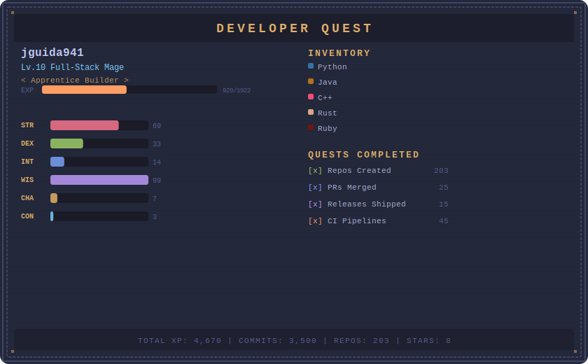

---

---

### Play Developer Quest

<a href="https://jguida941.github.io/stats/"><strong>Launch the playable mini-game</strong></a>

---

### By The Numbers

---

### Currently Working On

---

### Language Breakdown

---

### Contribution Calendar

---

### When I Code

---

### Featured Projects

---

### Recently Created

### Latest Activity

| Repository | Last Contributed |
|------------|-----------------|
| [**jguida941/homebrew-voiceterm**](https://github.com/jguida941/homebrew-voiceterm) | 1 day ago |
| [**jguida941/voiceterm**](https://github.com/jguida941/voiceterm) | 1 day ago |
| [**jguida941/homebrew-tap-setup**](https://github.com/jguida941/homebrew-tap-setup) | 1 week ago |
| [**jguida941/gitui**](https://github.com/jguida941/gitui) | 2 weeks ago |
| [**jguida941/learn-caesar-cipher**](https://github.com/jguida941/learn-caesar-cipher) | 3 weeks ago |
| [**jguida941/doubly_linked_list_demo**](https://github.com/jguida941/doubly_linked_list_demo) | 3 weeks ago |
| [**jguida941/adaptive-hashmap-studio**](https://github.com/jguida941/adaptive-hashmap-studio) | 3 weeks ago |
| [**jguida941/cihub-test-python-pyproject**](https://github.com/jguida941/cihub-test-python-pyproject) | 3 weeks ago |
| [**jguida941/homebrew-linkedlist**](https://github.com/jguida941/homebrew-linkedlist) | 3 weeks ago |
| [**jguida941/dijkstra-dashboard**](https://github.com/jguida941/dijkstra-dashboard) | 3 weeks ago |

### Recent Releases

| Repository | Version | Released |
|------------|---------|----------|
| [**jguida941/voiceterm**](https://github.com/jguida941/voiceterm) | [`v1.0.86`](https://github.com/jguida941/voiceterm/releases/tag/v1.0.86) | today |
| [**jguida941/ci-cd-hub**](https://github.com/jguida941/ci-cd-hub) | [`v1.0.0`](https://github.com/jguida941/ci-cd-hub/releases/tag/v1.0.0) | 2 months ago |
| [**jguida941/contact-suite-spring-react**](https://github.com/jguida941/contact-suite-spring-react) | [`legacy-contact-service-v1.0`](https://github.com/jguida941/contact-suite-spring-react/releases/tag/legacy-contact-service-v1.0) | 2 months ago |
| [**jguida941/pysort-visualizer**](https://github.com/jguida941/pysort-visualizer) | [`v1.0.0`](https://github.com/jguida941/pysort-visualizer/releases/tag/v1.0.0) | 3 months ago |
| [**jguida941/LinkedList**](https://github.com/jguida941/LinkedList) | [`v1.0.0`](https://github.com/jguida941/LinkedList/releases/tag/v1.0.0) | 5 months ago |

### Recent Pull Requests

| PR | Repository | Status | Opened |
|----|------------|--------|--------|
| [feat(theme-studio): add voice-scene runtime controls](https://github.com/jguida941/voiceterm/pull/6) | [**jguida941/voiceterm**](https://github.com/jguida941/voiceterm) | `MERGED` | today |
| [release: prepare v1.0.80 (MP-188/MP-189, lint hardening, docs/version sync)](https://github.com/jguida941/voiceterm/pull/5) | [**jguida941/voiceterm**](https://github.com/jguida941/voiceterm) | `MERGED` | 3 days ago |
| [refactor: pass voice drain context and dedupe event loop wiring](https://github.com/jguida941/voiceterm/pull/4) | [**jguida941/voiceterm**](https://github.com/jguida941/voiceterm) | `MERGED` | 4 days ago |
| [feat: v1.0.68 visual voice UX &#43; hardening follow-ups](https://github.com/jguida941/voiceterm/pull/3) | [**jguida941/voiceterm**](https://github.com/jguida941/voiceterm) | `MERGED` | 4 days ago |
| [feat: MP-085 project voice macros](https://github.com/jguida941/voiceterm/pull/2) | [**jguida941/voiceterm**](https://github.com/jguida941/voiceterm) | `MERGED` | 1 week ago |
