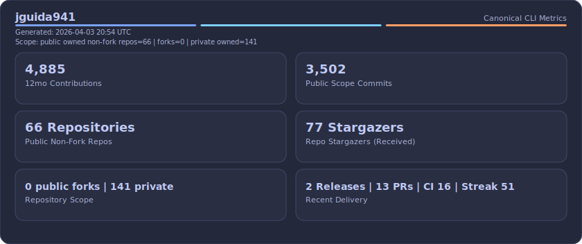
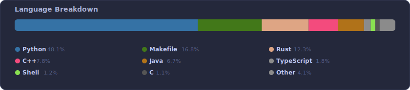
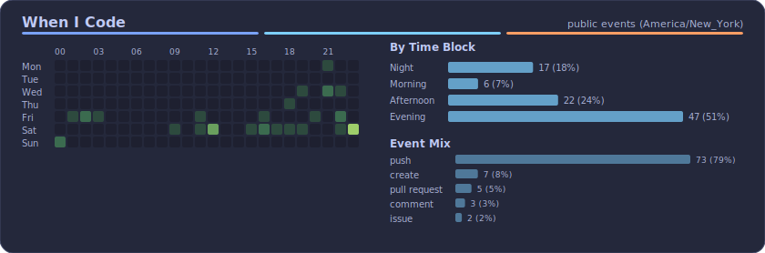
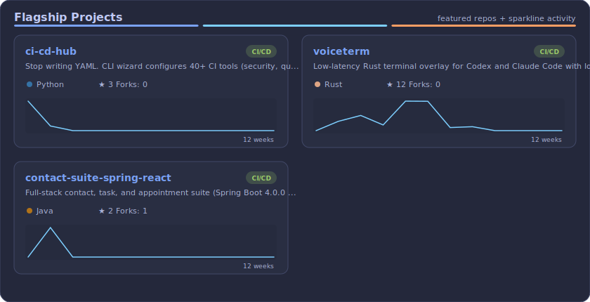

---

---

### By The Numbers

---

### Currently Working On

---

### Language Breakdown

---

### Contribution Calendar

---

### When I Code

---

### Featured Projects

---

### Raw Data Snapshot (Python Pull)

Generated by `scripts/build_readme.py` from the GitHub API.

| Metric | Value |
|--------|-------|
| Last 12 Months Contributions | `4180` |
| Public Repo Commits (Owned Non-Fork) | `2988` |
| Public Non-Fork Repos | `75` |
| Public Fork Repos | `0` |
| Private Owned Repos | `129` |
| Total Stars | `57` |
| Languages Detected | `25` |
| PRs Merged (Recent Events) | `0` |
| Releases (Recent Events) | `11` |
| Repos With CI/CD | `27` |
| Current Streak Days | `0` |

- **Repo scope:** `public + owned + non-fork` · owned public repos=`75` · forks=`0` · non-forks=`75` · owned private repos=`129`
- **Activity metric scope:** `GitHub contributionCalendar.totalContributions (last 12 months)`
- **Legend:** Contributions = commits + pull requests + issues + reviews (GitHub 12-month window).

### Featured Repo Facts

| Repository | Language | CI/CD | Stars | Forks | Last Push |
|------------|----------|-------|-------|-------|-----------|
| [**ci-cd-hub**](https://github.com/jguida941/ci-cd-hub) | `Python` | `yes` | `2` | `0` | 2026-02-23 |
| [**voiceterm**](https://github.com/jguida941/voiceterm) | `Rust` | `yes` | `7` | `0` | 2026-02-25 |
| [**lighting-opengl**](https://github.com/jguida941/lighting-opengl) | `C++` | `no` | `0` | `0` | 2026-02-16 |
| [**contact-suite-spring-react**](https://github.com/jguida941/contact-suite-spring-react) | `Java` | `yes` | `2` | `1` | 2026-02-23 |

### Language Stats (Raw)

| Language | Percent | Bytes |
|----------|---------|-------|
| `Python` | 43.0% | 11,254,368 |
| `Makefile` | 15.02% | 3,931,581 |
| `C++` | 12.17% | 3,184,489 |
| `Rust` | 9.83% | 2,574,010 |
| `C` | 7.67% | 2,007,111 |
| `Java` | 6.24% | 1,633,259 |
| `TypeScript` | 1.57% | 411,851 |
| `Shell` | 1.01% | 264,964 |
| `JavaScript` | 0.81% | 211,396 |
| `HTML` | 0.76% | 199,922 |
| `Jupyter Notebook` | 0.74% | 192,686 |
| `CMake` | 0.55% | 143,929 |

### Project Language + CI Matrix (Most Active)

| Repository | Language | CI/CD | Stars | Forks | Last Push |
|------------|----------|-------|-------|-------|-----------|
| [**jguida941**](https://github.com/jguida941/jguida941) | `Python` | `yes` | `0` | `0` | 2026-02-25 |
| [**voiceterm**](https://github.com/jguida941/voiceterm) | `Rust` | `yes` | `7` | `0` | 2026-02-25 |
| [**homebrew-voiceterm**](https://github.com/jguida941/homebrew-voiceterm) | `Ruby` | `no` | `0` | `0` | 2026-02-25 |
| [**contact-suite-spring-react**](https://github.com/jguida941/contact-suite-spring-react) | `Java` | `yes` | `2` | `1` | 2026-02-23 |
| [**ci-cd-hub**](https://github.com/jguida941/ci-cd-hub) | `Python` | `yes` | `2` | `0` | 2026-02-23 |
| [**lighting-opengl**](https://github.com/jguida941/lighting-opengl) | `C++` | `no` | `0` | `0` | 2026-02-16 |
| [**homebrew-tap-setup**](https://github.com/jguida941/homebrew-tap-setup) | `Rust` | `yes` | `1` | `0` | 2026-02-13 |
| [**homebrew-tap-setup-proof**](https://github.com/jguida941/homebrew-tap-setup-proof) | `Ruby` | `yes` | `0` | `0` | 2026-02-13 |
| [**gitui**](https://github.com/jguida941/gitui) | `Python` | `yes` | `0` | `0` | 2026-01-31 |
| [**homebrew-gitui**](https://github.com/jguida941/homebrew-gitui) | `Ruby` | `no` | `0` | `0` | 2026-01-31 |
| [**cihub-test-java-multi-module**](https://github.com/jguida941/cihub-test-java-multi-module) | `Java` | `yes` | `0` | `0` | 2026-01-27 |
| [**cihub-test-java-gradle**](https://github.com/jguida941/cihub-test-java-gradle) | `Java` | `yes` | `0` | `0` | 2026-01-27 |
| [**java-spring-tutorials**](https://github.com/jguida941/java-spring-tutorials) | `Java` | `yes` | `1` | `0` | 2026-01-27 |
| [**ci-cd-hub-canary-java-fail**](https://github.com/jguida941/ci-cd-hub-canary-java-fail) | `Java` | `yes` | `0` | `0` | 2026-01-27 |
| [**ci-cd-hub-fixtures**](https://github.com/jguida941/ci-cd-hub-fixtures) | `Java` | `yes` | `0` | `0` | 2026-01-27 |

---

### Recently Created

| Repository | Description | Language | Created |
|------------|-------------|----------|---------|
| [**jguida941**](https://github.com/jguida941/jguida941) | Profile README auto-updated | `Python` | 2026-02-20 |
| [**lighting-opengl**](https://github.com/jguida941/lighting-opengl) | n/a | `C++` | 2026-02-16 |
| [**homebrew-tap-setup**](https://github.com/jguida941/homebrew-tap-setup) | Step-based CLI to create Homebrew taps, wire GitHub, and scaffold formulas. | `Rust` | 2026-02-13 |
| [**homebrew-tap-setup-proof**](https://github.com/jguida941/homebrew-tap-setup-proof) | n/a | `Ruby` | 2026-02-13 |
| [**homebrew-gitui**](https://github.com/jguida941/homebrew-gitui) | n/a | `Ruby` | 2026-01-31 |
| [**homebrew-voiceterm**](https://github.com/jguida941/homebrew-voiceterm) | Homebrew tap for VoiceTerm -VoiceHUD for Codex and Claude with Whisper STT | `Ruby` | 2026-01-22 |
| [**OpenGL-Hourglass**](https://github.com/jguida941/OpenGL-Hourglass) | OpenGL hourglass scene (CS-330) with run.bat and shaders included. | `C++` | 2026-01-22 |
| [**mkgui**](https://github.com/jguida941/mkgui) | Analyze Python code and generate PyQt6 GUI scaffolding. Extracts functions, type | `Python` | 2026-01-20 |
| [**disk-analyzer**](https://github.com/jguida941/disk-analyzer) | A modern disk usage analyzer for the command line and desktop | `Python` | 2026-01-19 |
| [**parasync**](https://github.com/jguida941/parasync) | Dead simple Windows/Mac file sync over SSH for Parallels | `Python` | 2026-01-19 |

### Latest Owned Repo Activity

| Repository | Activity | Last Activity |
|------------|----------|---------------|
| [**jguida941/voiceterm**](https://github.com/jguida941/voiceterm) | `push` | 6 hours ago |
| [**jguida941/homebrew-voiceterm**](https://github.com/jguida941/homebrew-voiceterm) | `push` | 6 hours ago |
| [**jguida941/jguida941**](https://github.com/jguida941/jguida941) | `push` | 4 days ago |

### Recent Releases

| Repository | Version | Released |
|------------|---------|----------|
| [**jguida941/voiceterm**](https://github.com/jguida941/voiceterm) | [`v1.0.94`](https://github.com/jguida941/voiceterm/releases/tag/v1.0.94) | 6 hours ago |
| [**jguida941/voiceterm**](https://github.com/jguida941/voiceterm) | [`v1.0.90`](https://github.com/jguida941/voiceterm/releases/tag/v1.0.90) | 2 days ago |
| [**jguida941/voiceterm**](https://github.com/jguida941/voiceterm) | [`v1.0.89`](https://github.com/jguida941/voiceterm/releases/tag/v1.0.89) | 2 days ago |
| [**jguida941/voiceterm**](https://github.com/jguida941/voiceterm) | [`v1.0.88`](https://github.com/jguida941/voiceterm/releases/tag/v1.0.88) | 3 days ago |
| [**jguida941/voiceterm**](https://github.com/jguida941/voiceterm) | [`v1.0.87`](https://github.com/jguida941/voiceterm/releases/tag/v1.0.87) | 5 days ago |

### Recent Pull Requests

| PR | Repository | Status | Opened |
|----|------------|--------|--------|
|  | [**jguida941/voiceterm**](https://github.com/jguida941/voiceterm) | `OPEN` | 5 days ago |
|  | [**jguida941/voiceterm**](https://github.com/jguida941/voiceterm) | `OPEN` | 5 days ago |
