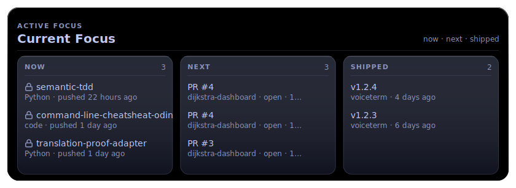
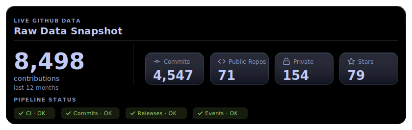

---

---

### Builder Scorecard

---

### Current Focus

---

### By The Numbers

---

### Currently Working On

---

### Language Breakdown

---

### Contribution Calendar

---

### When I Code

---

### Flagship Projects

---

### Raw Data Snapshot (Python Pull)

### Deep Dive Data

- [Open the full dashboard](https://jguida941.github.io/jguida941/)
- [Open raw profile snapshot JSON](site/data/profile_snapshot.json)
- Generated by `scripts/build_readme.py` from the GitHub API.
- Full project matrix, delivery feed, language distribution, and recently created repositories are preserved in the dashboard + JSON.
