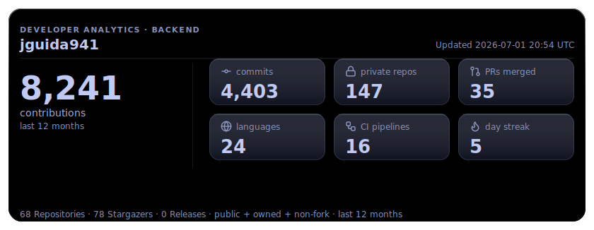
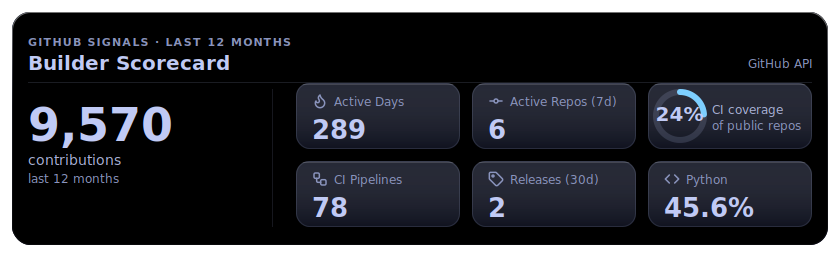
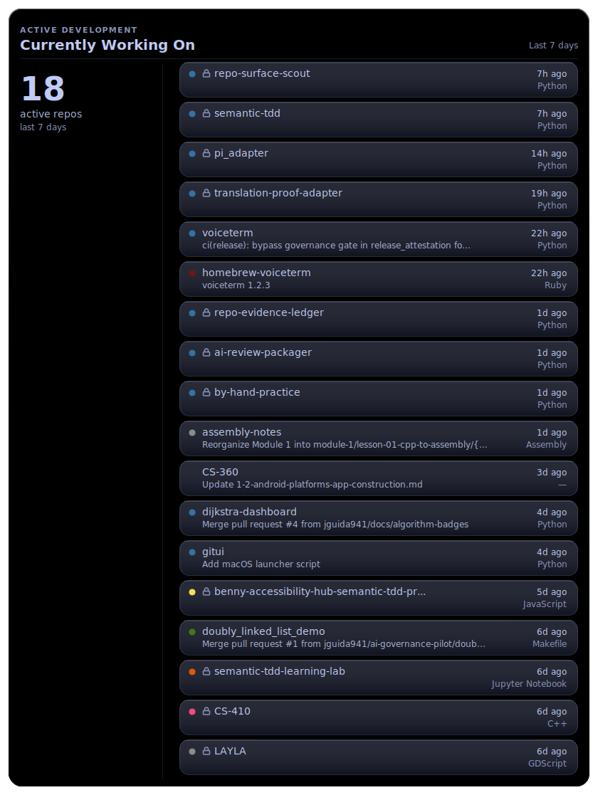
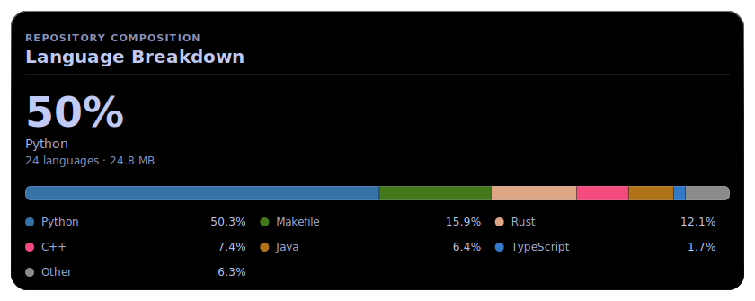
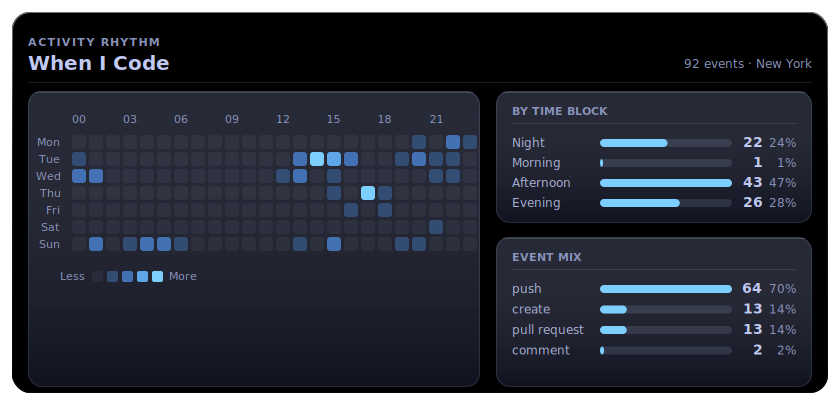
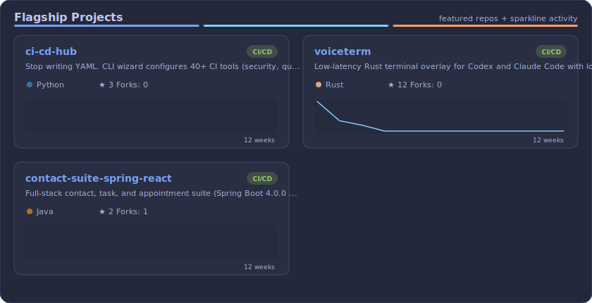

---

---

### Builder Scorecard

---

### Live Dashboard

[Open the full dashboard](https://jguida941.github.io/jguida941/)

---

### Now / Next / Shipped

| Now | Next | Shipped |
|-----|------|---------|
|[**No recent owned-repo activity found**](https://github.com/jguida941) Waiting for next push/PR/release event|[**Ship next iteration in jguida941**](https://github.com/jguida941/jguida941) Python · last push 2026-03-05  [**Ship next iteration in voiceterm**](https://github.com/jguida941/voiceterm) Rust · last push 2026-03-04|[**No recent release events captured**](https://github.com/jguida941?tab=repositories) Release feed is event-driven and may lag|

---

### By The Numbers

---

### Currently Working On

---

### Language Breakdown

---

### Contribution Calendar

---

### When I Code

---

### Flagship Projects

---

### Raw Data Snapshot (Python Pull)

Generated by `scripts/build_readme.py` from the GitHub API.

| Metric | Value |
|--------|-------|
| Last 12 Months Contributions | `4285` |
| Public Repo Commits (Owned Non-Fork) | `0` |
| Public Non-Fork Repos | `66` |
| Public Fork Repos | `0` |
| Private Owned Repos | `n/a` |
| Total Stars | `60` |
| Languages Detected | `24` |
| PRs Merged (Recent Events) | `0` |
| Releases (Recent Events) | `0` |
| Repos With CI/CD | `0` |
| Current Streak Days | `22` |

- **Repo scope:** `public + owned + non-fork` · owned public repos=`66` · forks=`0` · non-forks=`66` · owned private repos=`n/a`
- **Activity metric scope:** `GitHub contributionCalendar.totalContributions (last 12 months)`
- **Legend:** Contributions = commits + pull requests + issues + reviews (GitHub 12-month window).

### Featured Repo Facts

| Repository | Language | CI/CD | Stars | Forks | Last Push |
|------------|----------|-------|-------|-------|-----------|
| [**ci-cd-hub**](https://github.com/jguida941/ci-cd-hub) | `Python` | `yes` | `2` | `0` | 2026-02-23 |
| [**voiceterm**](https://github.com/jguida941/voiceterm) | `Rust` | `yes` | `8` | `0` | 2026-03-04 |
| [**contact-suite-spring-react**](https://github.com/jguida941/contact-suite-spring-react) | `Java` | `yes` | `2` | `1` | 2026-03-02 |

### Language Stats (Raw)

| Language | Percent | Bytes |
|----------|---------|-------|
| `Python` | 46.6% | 10,650,521 |
| `Makefile` | 17.2% | 3,930,927 |
| `Rust` | 12.82% | 2,931,224 |
| `C++` | 7.98% | 1,824,966 |
| `Java` | 6.93% | 1,583,192 |
| `TypeScript` | 1.8% | 411,851 |
| `Shell` | 1.24% | 283,578 |
| `C` | 1.18% | 268,582 |
| `JavaScript` | 0.92% | 211,396 |
| `HTML` | 0.87% | 199,922 |
| `Jupyter Notebook` | 0.84% | 192,686 |
| `CMake` | 0.62% | 141,191 |

### Project Language + CI Matrix (Most Active)

| Repository | Language | CI/CD | Stars | Forks | Last Push |
|------------|----------|-------|-------|-------|-----------|
| [**jguida941**](https://github.com/jguida941/jguida941) | `Python` | `yes` | `0` | `0` | 2026-03-05 |
| [**voiceterm**](https://github.com/jguida941/voiceterm) | `Rust` | `yes` | `8` | `0` | 2026-03-04 |
| [**homebrew-voiceterm**](https://github.com/jguida941/homebrew-voiceterm) | `Ruby` | `no` | `0` | `0` | 2026-03-04 |
| [**contact-suite-spring-react**](https://github.com/jguida941/contact-suite-spring-react) | `Java` | `yes` | `2` | `1` | 2026-03-02 |
| [**SNHU-CS-330**](https://github.com/jguida941/SNHU-CS-330) | `C++` | `no` | `0` | `0` | 2026-03-02 |
| [**opengl-cyberpunk**](https://github.com/jguida941/opengl-cyberpunk) | `C++` | `no` | `1` | `0` | 2026-03-02 |
| [**breakout-game-opengl**](https://github.com/jguida941/breakout-game-opengl) | `C++` | `no` | `1` | `0` | 2026-03-01 |
| [**java-spring-tutorials**](https://github.com/jguida941/java-spring-tutorials) | `Java` | `yes` | `1` | `0` | 2026-02-28 |
| [**ci-cd-hub**](https://github.com/jguida941/ci-cd-hub) | `Python` | `yes` | `2` | `0` | 2026-02-23 |
| [**homebrew-tap-setup**](https://github.com/jguida941/homebrew-tap-setup) | `Rust` | `yes` | `1` | `0` | 2026-02-13 |
| [**homebrew-tap-setup-proof**](https://github.com/jguida941/homebrew-tap-setup-proof) | `Ruby` | `yes` | `0` | `0` | 2026-02-13 |
| [**gitui**](https://github.com/jguida941/gitui) | `Python` | `yes` | `0` | `0` | 2026-01-31 |
| [**homebrew-gitui**](https://github.com/jguida941/homebrew-gitui) | `Ruby` | `no` | `0` | `0` | 2026-01-31 |
| [**dijkstra-dashboard**](https://github.com/jguida941/dijkstra-dashboard) | `Python` | `no` | `1` | `0` | 2026-01-27 |
| [**pysort-visualizer**](https://github.com/jguida941/pysort-visualizer) | `Python` | `no` | `1` | `0` | 2026-01-26 |

---

### Recently Created

| Repository | Description | Language | Created |
|------------|-------------|----------|---------|
| [**SNHU-CS-330**](https://github.com/jguida941/SNHU-CS-330) | n/a | `C++` | 2026-03-02 |
| [**breakout-game-opengl**](https://github.com/jguida941/breakout-game-opengl) | A 2D Breakout game built in C++ with OpenGL and GLFW. Break multi-hit bricks, ma | `C++` | 2026-03-01 |
| [**opengl-cyberpunk**](https://github.com/jguida941/opengl-cyberpunk) | Stylized OpenGL cyberpunk 3D scene built in C++ with GLFW, GLEW, and GLM. | `C++` | 2026-02-23 |
| [**jguida941**](https://github.com/jguida941/jguida941) | Profile README auto-updated | `Python` | 2026-02-20 |
| [**homebrew-tap-setup**](https://github.com/jguida941/homebrew-tap-setup) | Step-based CLI to create Homebrew taps, wire GitHub, and scaffold formulas. | `Rust` | 2026-02-13 |
| [**homebrew-tap-setup-proof**](https://github.com/jguida941/homebrew-tap-setup-proof) | n/a | `Ruby` | 2026-02-13 |
| [**homebrew-gitui**](https://github.com/jguida941/homebrew-gitui) | n/a | `Ruby` | 2026-01-31 |
| [**homebrew-voiceterm**](https://github.com/jguida941/homebrew-voiceterm) | Homebrew tap for VoiceTerm -VoiceHUD for Codex and Claude with Whisper STT | `Ruby` | 2026-01-22 |
| [**OpenGL-Hourglass**](https://github.com/jguida941/OpenGL-Hourglass) | OpenGL hourglass scene (CS-330) with run.bat and shaders included. | `C++` | 2026-01-22 |
| [**mkgui**](https://github.com/jguida941/mkgui) | Analyze Python code and generate PyQt6 GUI scaffolding. Extracts functions, type | `Python` | 2026-01-20 |

### Latest Owned Repo Activity

| Repository | Activity | Last Activity |
|------------|----------|---------------|
| n/a | `n/a` | no recent owned-repo activity captured |

### Recent Releases

| Repository | Version | Released |
|------------|---------|----------|
| n/a | `n/a` | no recent release events captured |

### Recent Pull Requests

| PR | Repository | Status | Opened |
|----|------------|--------|--------|
| n/a | n/a | `n/a` | no recent PR events captured |
